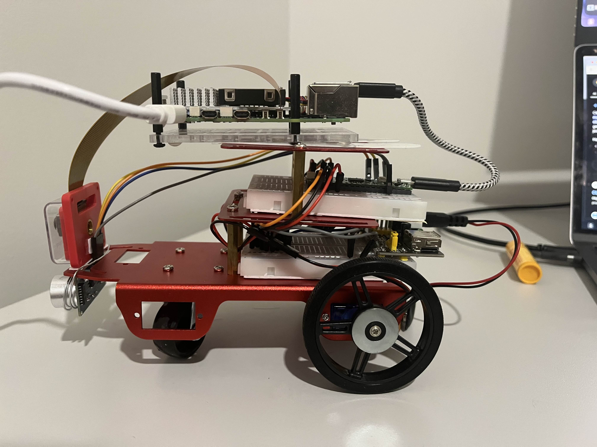

# WALL-E 
> A Wall-Evading rover



## Demo

https://github.com/user-attachments/assets/5d728668-df3b-49ff-8af7-fae13c4f263e

https://github.com/user-attachments/assets/933dd85c-a1db-4a21-8435-bca50764d21d

## Components
- Raspberry Pi 5 - The brain of the rover
- Raspberry Pi Pico - The Motor Controller
- HC-SR04 Ultrasonic Sensor - Measure distance from wall
- Pi Camera Module 3 - Recording (object detection in the future)
- L293D - Motor Driver

## Development
```shell
# build brain
make brain/build

# run brain
make brain/run

# build and flash the driver software onto the pico
make driver/build

# reboot the driver (mainly for development)
make driver/reboot

# stream the camera output through a TCP server
python3 brain/camera.py
```
