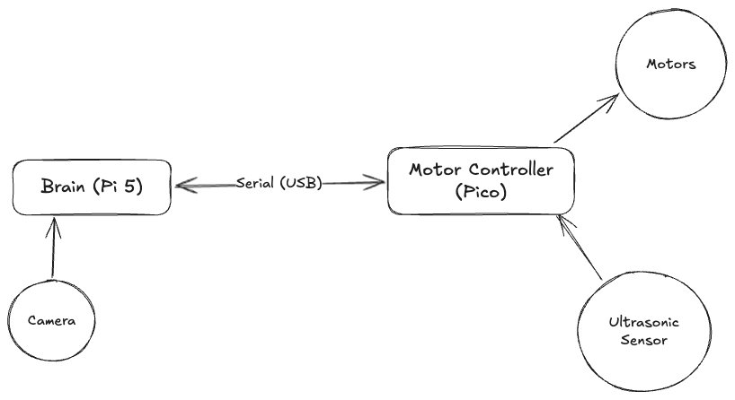
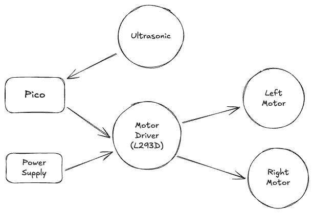
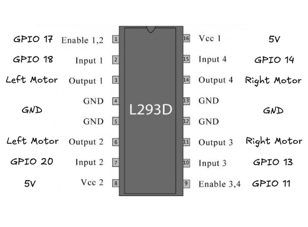
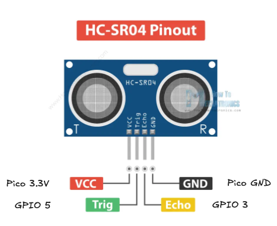
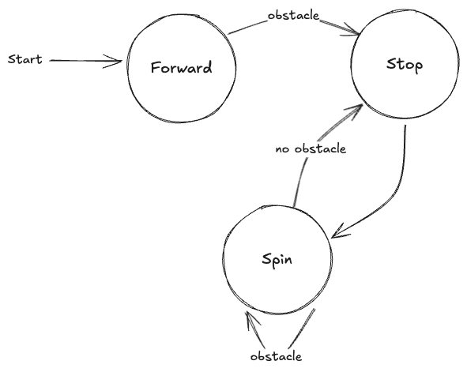

# Wall-E 

## Intro

### What 
- Build a rover from scratch that can evade walls, re-using parts from the old rover
- (Bonus) Integrate AI vision capabilities

### Why
- Got the rover from a previous student
- Wanted to extend on the work by adding vision capabilities
- The AI kit would use all of the the GPIOs from the Pi 5, which won't work with the previous design since it used some of the GPIOs
- Decided to use the Pico to expose the GPIOs instead, and communicate with the Pi 5 through USB serial
- Since most of the code will probably be different, might as well re-design the rover

### How
- Discuss the high-level design of each components in the rover and how they interact with each other
- Discuss the build process for each components and some of the challenges during the process
- Discuss the results after the build and future improvements

## Design

- Two main components:
    - Motor Controller (Pico): controls the speed and direction of the two motors as well as the ultrasonic sensor
    - Brain (Pi 5): sending commands to the motors and getting feedback from the ultrasonic sensors through the motor controller
    - The Pi 5 and Pico talks to each other through USB serial communication

### Motor Controller 

- Pico: 
    - Sends PWM signals to the Motor Driver    
    - Gets the readings from the ultrasonic sensor
- Motor Driver (L293D): 
    - Connects the power supply to the motors (protects the pico as well) 
    - Connects to the pico to control the motors' speed and direction
- Motors: 4-6V DC motors in micro-servo body, no encoders
- Power Supply: supply a 5V current to the motors 
- Ultrasonic sensor: detects the distance, in centimeteres, from the front of the rover to the nearest object

### Brain

- Pi 5: controls the rover through the Pico, communicate through serial USB 
- Pi Camera Module 3: 
    - Originally planned to have computer vision capabilities, but didn't have enough time
    - Record the front of the rover for now
- Simple state machine for wall-evading behavior 
    - Go forward by default
    - If encounter a wall, Stop and spin around
    - If the sensor no longer see a wall, stop spinning and go forward again

### Serial Communication

- Pico -> Pi 5: in the format `<message specfier> <message>`, where message specifiers are one of the following:
    - `d` - Debug: mainly for debugging purposes
    - `i` - Info: sending the ultrasonic sensor readings, the message for this should be an int representing the distance from the sensor to the nearest object in front of the sensor (in centimeters)
    - `e` - Error: errors from the Pico (messages from Pi 5 not in correct format, gpio errors, etc) 

- Pi 5 -> Pico: in the format `<left motor direction> <left motor speed> <right motor direction> <right motor speed>`
    - Direction can be 0 - Stop, 1 - Forward, 2 - Backward
    - Speed is in the range 0 to 1

## Build Process

### Circuit Assemble
- Disassemble the necessary parts from the old rover
- Finding enough space to fit two breadboards onto the rover
    - Add another level to the rover for more space
- Assemble the circuitry for the motors and sensor

### Motor Driver
- Implement logic for controlling the motors and reading the sensor
    - Motors: Test changing direction by alternating the ouput pin, test changing speed by using PWM on the Enable pin on the L293D Motor Controller 
    - Ultrasonic Sensor: Get the distance by measure the time it takes for the sound to get emitted from the sensor to the time the sound comes back to the sensor
        - Similar to the homework for the photocell and capacitor, where we need to calculate the time it takes for the capacitor to get charged  

- Event loop for handling motor requests and sending sensors value. For each loop:
    - Send the sensor value
    - Check `stdio` if there are messages available. Uses Pico SDK's `getchar_timeout_us` for non-blocking capability (Multicore can also work, but non-blocking is more efficient).
    - If not time out then read the message set the corresponding values to the motors

- Test Pico logic using `screen`
    - I used `screen` since it is already availble on Pi OS, but any program that allows for serial communication would also work  
    - `screen /dev/ttyACM0 115200`
    - Making sure that the sensor readings are sent correct and the Pico read the motor message correctly

### Brain
- Implement serial communication using c standard libraries
    - When sending serial message with `<unistd.h>`'s `write()`, use `strlen()` instead of `sizeof()` for the number of bytes to send, since `sizeof` will also include the null terminator in the string, while `strlen` exludes it.
    - `<termios.h>` has default behaviors that is not intuitive to use, so it took quite a bit of time to debug. 

- Implement a state machine for wall-evading behavior

- Test mostly by message logs and seeing motor behaviors

- Add recording from camera 

### Final Assemble and Test Run
- Reuse metal cables from the old rover for securing the ultrasonic sensor in the front of the rover 
- 3M Command strips are extremely useful for attaching and removing temporary stuff
- Since the motor doesn't have an encoder, there is no way to tell what the rotation angle the car has completed, so I have to use some small time sleep to estimate the rotation 

## Result

[Insert Demo Video]

## Future Work

### Hardware
- **Bigger chassis**: There was barely enough space to cram in enough technologies, and the motors can barely carry all the weight. I have to use 5V to the motors for the rover to be able to turn 
- **Stronger motors with encoders**: knowing the amount of rotation that a motor has done is important for angle turn accuracy
- **Lidar sensor**: ultrasonic sensor is inherently inaccurate and dependent on the object around it (some object reflect sounds better) while not being flexible for getting envronment info. Lidar sensor can alleviate these problems as a 360-degree sensor with higher accuracy and range. Ultrasonic can still be used for notifying that the rover is approaching an obstacle.  
- **Using ball-bearing caster wheel instead of the regular caster wheel**: 
    - With the current caster wheel, the rover doesn't go straight when it is supposed to since the wheel doesn't stay straight during movement
    - The old rover mitigated this problem by using some metal wires to hold the wheel in place
    - This solution doesn't work anymore with the current design because of the weight of the rover (the rover couldn't turn because of the friction caused by the extra weight on the wheel)
    - Ball-bearing wheel will solve this problem since it is omnidirectional

### Software

- Object detection model in the camera: The original goal of the project. Integrating the camera with the AI kit can add object detection capabilities to the rover 

- ROS for SLAM: using ROS will allow the rover to use libraries built for SLAM (Simultaneous Localization and Mapping), which basically add roomba capabilities to the rover (without the cleaning part).
