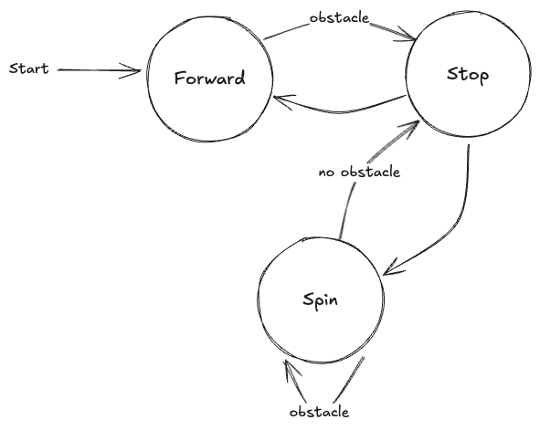

Intro
---
# Intro > What? 


<!-- end_slide -->

# Intro > Why?

<!-- column_layout: [1, 1] -->
<!-- column: 0 -->


<!-- column: 1 -->


<!-- reset_layout -->
<!-- end_slide -->

# Intro > How?
- High-level design 
- Build process + Challenges 
- Results 
- Future improvements

<!-- end_slide -->

Design
---


<!-- end_slide -->

# Design > Motor Controller


<!-- end_slide -->

## Design > Motor Controller > Motor Driver

<!-- end_slide -->

## Design > Motor Controller > Ultrasonic

<!-- end_slide -->

# Design > Brain

<!-- end_slide -->

# Design > Serial Communication
<!-- column_layout: [1, 2] -->
<!-- column: 0 -->

## Pico -> Pi 5 
`<message specfier> <message>`

- `i` - Info
- `d` - Debug
- `e` - Error

<!-- column: 1 -->
## Pi 5 -> Pico 
`<left motor direction> <left motor speed> <right motor direction> <right motor speed>`

- Direction 
    - 0 - Stop 
    - 1 - Forward
    - 2 - Backward
- Speed: [0 - 1]

<!-- reset_layout -->
<!-- end_slide -->

Build Process
---

# Build Process > Circuit Assemble


<!-- end_slide -->

# Build Process > Motor Controller
## Build Process > Motor Controller > Motor Driver
<!-- column_layout: [1, 1] -->
<!-- column: 0 -->
```c
void SetMotor(MotorInfo* info, enum Direction d, float speed) {
  switch (d) {
    case FORWARD:
      gpio_put(info->frontGPIO, true);
      gpio_put(info->backGPIO, false);
      break;
    case BACKWARD:
      gpio_put(info->frontGPIO, false);
      gpio_put(info->backGPIO, true);
      break;
    case STOP:
      gpio_put(info->frontGPIO, false);
      gpio_put(info->backGPIO, false);
      break;
  }

  setPWM(info->pwmGPIO, 100.0f, speed);
}
```
<!-- column: 1 -->


<!-- reset_layout -->
<!-- end_slide -->

## Build Process > Motor Controller > Ultrasonic 
<!-- column_layout: [1, 1] -->
<!-- column: 0 -->
```c
uint64_t getPulse(uint trigPin, uint echoPin) {
  gpio_put(trigPin, 1);
  sleep_us(10);
  gpio_put(trigPin, 0);

  uint64_t width = 0;

  while (gpio_get(echoPin) == 0) tight_loop_contents();
  absolute_time_t startTime = get_absolute_time();
  while (gpio_get(echoPin) == 1) {
    width++;
    sleep_us(1);
    if (width > timeout) return 0;
  }
  absolute_time_t endTime = get_absolute_time();

  return absolute_time_diff_us(startTime, endTime);
}
```
<!-- column: 1 -->

<!-- reset_layout -->
<!-- end_slide -->

## Build Process > Motor Controller > Main Loop
```c
  while (true) {
    Logger(INFO, "%d", GetCm(&sensorInfo));

    int chr = getchar_timeout_us(100000);
    if (chr == PICO_ERROR_TIMEOUT) {
      continue;
    }

    if (chr == '\r') {
      handleMsg(msgBuf, &leftMotor, &rightMotor);
      continue;
    }

    if (idx >= MSG_BUF_SIZE) {
      continue;
    }

    msgBuf[idx++] = chr;
  }
```

```shell
screen /dev/ttyACM0 115200
```
<!-- end_slide -->

# Build Process > Brain 
## Build Process > Brain > Serial Communication
<!-- column_layout: [1, 1] -->
<!-- column: 0 -->
- Config
```c
  serialPort = open("/dev/ttyACM0", O_RDWR);

  struct termios tty;
  AssertErr(tcgetattr(serialPort, &tty));
  tty.c_cflag &= ~PARENB;
  tty.c_cflag &= ~CSTOPB;
  tty.c_cflag &= ~CSIZE;
  tty.c_cflag |= CS8;
  tty.c_cflag &= ~CRTSCTS;
  tty.c_cflag |= CREAD | CLOCAL;
  tty.c_lflag &= ~ICANON;
  tty.c_lflag &= ~ECHO;
  tty.c_lflag &= ~ECHOE;
  tty.c_lflag &= ~ECHONL;
  tty.c_lflag &= ~ISIG;
  tty.c_iflag &= ~(IXON | IXOFF | IXANY);
  tty.c_iflag &= ~(IGNBRK | BRKINT | PARMRK | ISTRIP | INLCR | IGNCR | ICRNL);
  tty.c_oflag &= ~OPOST;
  tty.c_oflag &= ~ONLCR;
  tty.c_cc[VTIME] = 10;
  tty.c_cc[VMIN] = 0;
  cfsetspeed(&tty, B115200);
  AssertErr(tcsetattr(serialPort, TCSANOW, &tty));
```
<!-- column: 1 -->
- Read
```c
#include <unistd.h>
read(serialPort, c, 1)
```
- Write
```c
#include <unistd.h>
write(serialPort, buf, strlen(buf)
```
<!-- reset_layout -->
<!-- end_slide -->

## Build Process > Brain > State Machine
<!-- column_layout: [1, 1] -->
<!-- column: 0 -->
```c
  enum State currState = GetCurrState();
  enum State prevState = GetPrevState();

  if (prevState == FORWARD && currState == STOP) {
    WriteMsg("0 0 0 0");
    SetCurrState(SPIN);
  }

  if (prevState == STOP && currState == SPIN) {
    WriteMsg("1 1 2 1");
    SetCurrState(SPIN);
    usleep(500 * 1000);
  }

  if (prevState == SPIN && currState == STOP) {
    WriteMsg("0 0 0 0");
    SetCurrState(FORWARD);
  }

  if (prevState == STOP && currState == FORWARD) {
    WriteMsg("1 1 1 1");
    SetCurrState(FORWARD);
  }
```

<!-- column: 1 -->


<!-- reset_layout -->
<!-- end_slide -->

## Build Process > Brain > Test
```
DEBUG | write 1 1 1 1
DEBUG | (pico debug) Connected
DEBUG | (pico info) 65
DEBUG | new Dist 65 | curr Dist -1
DEBUG | (pico info) 47
DEBUG | new Dist 47 | curr Dist 65
DEBUG | (pico info) 65
DEBUG | new Dist 65 | curr Dist 47
DEBUG | (pico info) 49
DEBUG | new Dist 49 | curr Dist 65
DEBUG | (pico info) 65
DEBUG | new Dist 65 | curr Dist 49
DEBUG | (pico info) 50
DEBUG | new Dist 50 | curr Dist 65
DEBUG | (pico info) 64
DEBUG | new Dist 64 | curr Dist 50
DEBUG | (pico info) 50
DEBUG | new Dist 50 | curr Dist 64
DEBUG | (pico debug) Received msg 1 1 1 1
DEBUG | (pico debug) Left Motor Direction 1
DEBUG | (pico debug) Left Motor Speed 1.00
DEBUG | (pico debug) Right Motor Direction 1
DEBUG | (pico debug) Right Motor Speed 1.00
DEBUG | (pico info) 51
DEBUG | new Dist 51 | curr Dist 50
DEBUG | (pico info) 65
DEBUG | new Dist 65 | curr Dist 51
```
<!-- end_slide -->

# Build Process > Final Assemble and Test Run
<!-- column_layout: [1, 1] -->
<!-- column: 0 -->


<!-- column: 1 -->


<!-- reset_layout -->
<!-- end_slide -->

Result
---
<!-- column_layout: [1, 1] -->
<!-- column: 0 -->

# Before


<!-- column: 1 -->

# After

<!-- reset_layout -->
<!-- end_slide -->

Future Work
---
<!-- column_layout: [1, 1] -->
<!-- column: 0 -->

# Object Detection


<!-- column: 1 -->

# Robot Operating System

<!-- reset_layout -->
<!-- end_slide -->

The End
---

